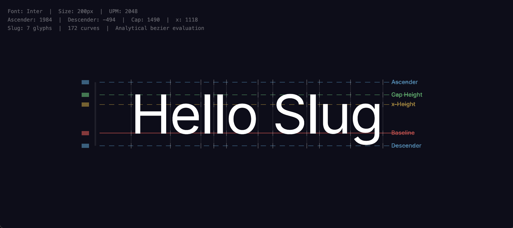

# Slug Algorithm (WebGPU)

A WebGPU implementation of the Slug algorithm, originally created by Eric Lengyel.

This project ports the original HLSL shaders to WGSL and demonstrates a modern GPU-driven text rendering pipeline.

## Overview

The Slug algorithm renders high-quality vector text entirely on the GPU by converting glyph outlines into a banded Bézier representation.

This repository includes:
- WGSL shader implementations of the Slug algorithm
- A minimal WebGPU rendering setup
- A TypeScript-based shaping pipeline using `text-shaper` (a HarfBuzz alternative)
- An example using the Inter font

## Rendering Pipeline

1. **Text shaping (CPU)**  
   Text is shaped into positioned glyphs using `text-shaper`.

2. **Curve extraction (CPU)**  
   Glyph outlines are converted into quadratic Bézier curves.

3. **Band organization (CPU)**  
   Curves are partitioned into vertical and horizontal bands.

4. **Rendering (GPU)**  
   The Slug algorithm evaluates the bands and rasterizes glyphs fully on the GPU.

## Getting Started

### Requirements
- Bun v1.2+
- A WebGPU-compatible browser (e.g. Chrome, Edge)

### Install

```bash
bun install
```

### Acknowledgements
Huge thanks to Eric Lengyel for creating the Slug algorithm and releasing it into the public domain.

### Sources
- https://github.com/EricLengyel/Slug
- https://terathon.com/blog/decade-slug.html
